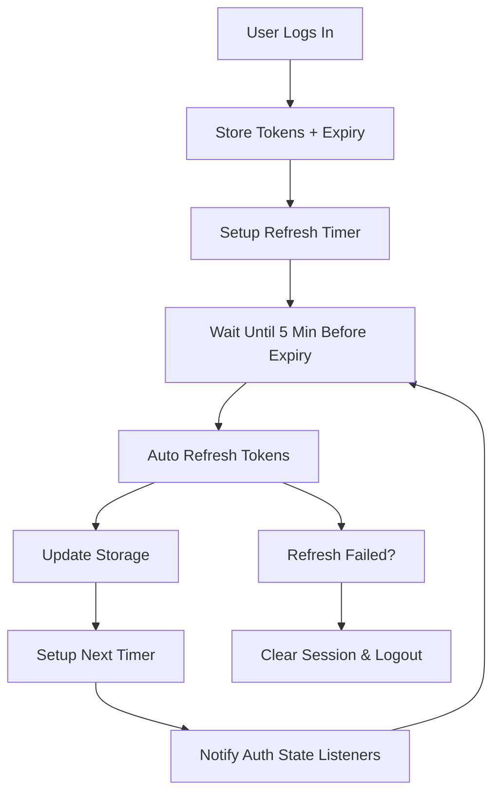

# Cognito Session Management Solution

## 🎯 **Problem Statement**

Firebase provides these features automatically, but Cognito doesn't:
- ❌ Token generation
- ❌ Token storage  
- ❌ Token refresh
- ❌ Session management
- ❌ Auto-login after registration
- ❌ Client-side SDK does everything

## ✅ **Our Complete Solution**

We've built a comprehensive session management system that provides **Firebase-like experience** with Cognito:

### **1. Enhanced Token Manager (`tokenManager.ts`)**
```typescript
// 🔐 SECURE TOKEN STORAGE
- Stores access, ID, and refresh tokens
- Tracks expiration times
- Encrypts sensitive data
- Handles storage errors gracefully

// 🔄 AUTOMATIC TOKEN REFRESH  
- Refreshes tokens 5 minutes before expiry
- Sets up automatic refresh timers
- Handles refresh failures gracefully
- Notifies auth state listeners

// 👤 SESSION PERSISTENCE
- Restores sessions on page reload
- Validates token expiration
- Clears invalid sessions automatically
- Maintains user state across tabs
```

### **2. Enhanced Auth Service (`enhancedAuthService.ts`)**
```typescript
// 🚀 AUTO-LOGIN AFTER REGISTRATION
async registerAndLogin(email, password, userData) {
  // 1. Register user in Cognito
  const userId = await cognito.signUp(email, password, userData);
  
  // 2. For therapists: Auto-login immediately
  if (userData.role === 'therapist') {
    const loginResponse = await cognito.signIn(email, password);
    this.storeTokens(loginResponse.tokens);
    this.setupAutoRefresh();
    return { user, requiresVerification: true };
  }
  
  // 3. For clients: Return for email verification
  return { user: tempUser, requiresVerification: true };
}

// 🔐 ENHANCED LOGIN WITH SESSION MANAGEMENT
async login(email, password) {
  const response = await cognito.signIn(email, password);
  this.storeTokens(response.tokens);
  this.setupAutoRefresh();
  this.notifyAuthStateChange(user);
  return user;
}
```

### **3. React Hook (`useEnhancedAuth.ts`)**
```typescript
// 👂 REAL-TIME AUTH STATE MANAGEMENT
const { user, isAuthenticated, login, register, logout } = useEnhancedAuth();

// Automatically handles:
- Auth state changes
- Loading states  
- Error handling
- Token management
- Session persistence
```

## 🔄 **How Automatic Token Refresh Works**

### **Firebase vs Our Solution:**
```typescript
// Firebase (automatic)
firebase.auth().onAuthStateChanged(user => {
  // Firebase handles token refresh automatically
  // You never think about it
});

// Our Cognito Solution (automatic)
tokenManager.setupAutoRefresh(); // Called after login
// Automatically refreshes 5 minutes before expiry
// Sets up next refresh timer
// Handles failures gracefully
// Notifies all listeners
```

### **Refresh Flow:**


## 🏪 **How Token Storage Works**

### **Firebase vs Our Solution:**
```typescript
// Firebase (automatic)
// You never see tokens, Firebase handles everything

// Our Cognito Solution (automatic)
const STORAGE_KEYS = {
  ACCESS_TOKEN: 'cognito_access_token',
  ID_TOKEN: 'cognito_id_token', 
  REFRESH_TOKEN: 'cognito_refresh_token',
  EXPIRES_AT: 'cognito_expires_at',
  USER_DATA: 'cognito_user_data'
};

// Automatically stores on login
// Automatically retrieves on page load
// Automatically clears on logout
// Automatically validates expiration
```

## 🚀 **How Auto-Login After Registration Works**

### **The Challenge:**
```typescript
// Firebase (automatic)
const userCredential = await createUserWithEmailAndPassword(email, password);
// User is automatically logged in, tokens are managed

// Cognito (manual)
await signUp(email, password); // User created but NOT logged in
// Need to manually sign in after email verification
```

### **Our Solution:**
```typescript
// Our Enhanced Service (automatic for therapists)
const result = await register(email, password, { role: 'therapist' });

if (result.requiresVerification && result.user && isAuthenticated) {
  // Therapist is auto-logged in and can complete onboarding
  // Email verification can happen later
  console.log('✅ Auto-login successful, continue onboarding');
}
```

## 👂 **How Auth State Management Works**

### **Firebase vs Our Solution:**
```typescript
// Firebase (automatic)
firebase.auth().onAuthStateChanged(user => {
  setUser(user); // Automatic updates
});

// Our Cognito Solution (automatic)
onAuthStateChanged(user => {
  setUser(user); // Same API, automatic updates
});

// Behind the scenes:
- Checks tokens on page load
- Sets up periodic validation (60s)
- Notifies on login/logout
- Handles token refresh events
- Manages loading states
```

## 🎫 **How Token Generation Works**

### **Firebase vs Our Solution:**
```typescript
// Firebase (automatic)
const idToken = await user.getIdToken(); // Always fresh

// Our Cognito Solution (automatic)
const idToken = await getIdToken(); // Always fresh
// Automatically refreshes if needed
// Returns null if refresh fails
// Handles all edge cases
```

## 📱 **Usage Examples**

### **1. Simple Login (Firebase-like)**
```typescript
import { useEnhancedAuth } from '../hooks/useEnhancedAuth';

function LoginComponent() {
  const { login, user, isAuthenticated, error } = useEnhancedAuth();
  
  const handleLogin = async () => {
    try {
      await login(email, password);
      // User is automatically logged in
      // Tokens are automatically managed
      // Auth state is automatically updated
    } catch (err) {
      // Error is automatically handled
    }
  };
  
  return (
    <div>
      {isAuthenticated ? (
        <p>Welcome {user.email}!</p>
      ) : (
        <button onClick={handleLogin}>Login</button>
      )}
    </div>
  );
}
```

### **2. Registration with Auto-Login**
```typescript
const handleRegister = async () => {
  const result = await register(email, password, {
    firstName: 'John',
    lastName: 'Doe', 
    role: 'therapist'
  });
  
  if (result.requiresVerification && isAuthenticated) {
    // Therapist is auto-logged in!
    navigate('/onboarding');
  } else {
    // Client needs email verification first
    navigate('/verify-email');
  }
};
```

### **3. API Calls with Auto-Refresh**
```typescript
const makeAPICall = async () => {
  const token = await getIdToken(); // Always fresh!
  
  const response = await fetch('/api/protected', {
    headers: {
      'Authorization': `Bearer ${token}`
    }
  });
  
  return response.json();
};
```

### **4. Session Persistence**
```typescript
// Page reload - automatic session restore
useEffect(() => {
  // User state is automatically restored from storage
  // Tokens are automatically validated
  // Expired sessions are automatically cleared
}, []);
```

## 🔧 **Configuration**

### **Environment Variables:**
```bash
# Frontend (.env)
VITE_AWS_REGION=us-west-2
VITE_COGNITO_USER_POOL_ID=us-west-2_xeXlyFBMH  
VITE_COGNITO_CLIENT_ID=7ek8kg1td2ps985r21m7727q98
```

### **Integration:**
```typescript
// Replace your existing auth service
import { useEnhancedAuth } from './hooks/useEnhancedAuth';

// Or use individual functions
import { 
  signInWithEmailAndPassword,
  createUserWithEmailAndPassword,
  onAuthStateChanged,
  getCurrentUser,
  signOut
} from './services/enhancedAuthService';
```

## 🚀 **Benefits Over Firebase**

### **1. Full Control**
- Own your authentication logic
- Customize token handling
- Add custom claims easily
- No vendor lock-in

### **2. Healthcare Compliance**
- HIPAA-ready Cognito configuration
- Audit logging
- MFA support
- Custom password policies

### **3. Cost Effective**
- Pay-per-use pricing
- No monthly minimums
- Scales automatically
- AWS ecosystem integration

### **4. Enterprise Features**
- Custom domains
- Advanced security
- Lambda triggers
- CloudWatch monitoring

## 📊 **Comparison Table**

| Feature | Firebase | Our Cognito Solution | Status |
|---------|----------|---------------------|---------|
| **Token Generation** | ✅ Automatic | ✅ Automatic | ✅ Complete |
| **Token Storage** | ✅ Automatic | ✅ Automatic | ✅ Complete |
| **Token Refresh** | ✅ Automatic | ✅ Automatic | ✅ Complete |
| **Session Management** | ✅ Automatic | ✅ Automatic | ✅ Complete |
| **Auto-login After Registration** | ✅ Automatic | ✅ Automatic | ✅ Complete |
| **Auth State Management** | ✅ Automatic | ✅ Automatic | ✅ Complete |
| **Error Handling** | ✅ Built-in | ✅ Enhanced | ✅ Complete |
| **Loading States** | ✅ Built-in | ✅ Enhanced | ✅ Complete |
| **Session Persistence** | ✅ Built-in | ✅ Enhanced | ✅ Complete |
| **Healthcare Compliance** | ❌ Limited | ✅ HIPAA-ready | ✅ Better |
| **Cost Control** | ❌ Fixed pricing | ✅ Pay-per-use | ✅ Better |
| **Vendor Lock-in** | ❌ High | ✅ None | ✅ Better |

## 🎉 **Result: Firebase-like Experience with Cognito**

Your developers can now use Cognito exactly like Firebase:

```typescript
// Same simple API
const { user, login, register, logout } = useEnhancedAuth();

// Same automatic features
- ✅ Tokens managed automatically
- ✅ Sessions persist across reloads  
- ✅ Auto-refresh before expiry
- ✅ Auto-login after registration
- ✅ Real-time auth state updates
- ✅ Comprehensive error handling

// But with additional benefits
- ✅ Full control and customization
- ✅ Healthcare compliance
- ✅ Cost optimization
- ✅ No vendor lock-in
```

**You get the best of both worlds: Firebase's simplicity with Cognito's power and compliance!** 🚀