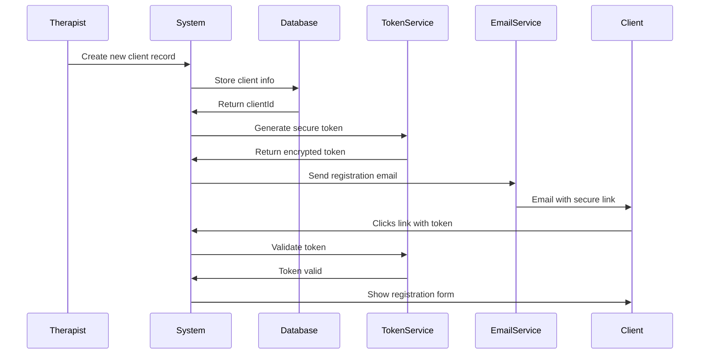

# 🔐 Secure Client Registration Links - Examples

## Overview

This document shows examples of how the secure client registration links work in production and how to test them safely.

---

## 🔗 Link Structure

### Production Link Format:
```
https://your-domain.com/register?token=TOKEN-VALUE&email=client@example.com
```

### Test Environment Links:

#### Test Client #1: Sarah Johnson
```
http://localhost:3000/register?token=TOKEN-SARAH-12345-SECURE&email=sarah.johnson@test.com
```

#### Test Client #2: Michael Chen  
```
http://localhost:3000/register?token=TOKEN-MICHAEL-67890-SECURE&email=michael.chen@test.com
```

#### Test Client #3: Emily Rodriguez
```
http://localhost:3000/register?token=TOKEN-EMILY-11111-SECURE&email=emily.rodriguez@test.com
```

#### Test Client #4: James Williams
```
http://localhost:3000/register?token=TOKEN-JAMES-22222-SECURE&email=james.williams@test.com
```

#### Test Client #5: Maria Garcia
```
http://localhost:3000/register?token=TOKEN-MARIA-33333-SECURE&email=maria.garcia@test.com
```

---

## 📧 How Links Are Sent (Production)

### Email Template Example:

```html
Subject: Complete Your Registration - Ataraxia Wellness

Hello [Client Name],

You've been invited to complete your client registration for Ataraxia Wellness.

Please click the secure link below to get started:

[SECURE REGISTRATION LINK]

This link is unique to you and expires in 72 hours.

If you didn't expect this email, please ignore it.

Best regards,
Ataraxia Team
```

### SMS Template Example:

```
Ataraxia Wellness: Complete your registration here: 
[SHORT LINK]
Expires in 72 hours. Reply STOP to unsubscribe.
```

---

## 🔐 Security Features

### Token Requirements:
- **Unique:** Each client gets a unique token
- **Single-use:** Token becomes invalid after successful registration
- **Time-limited:** Expires after 72 hours (configurable)
- **Encrypted:** Token contains encrypted client information
- **Validated:** Backend validates token before allowing access

### What the Token Contains (Encrypted):
```json
{
  "clientId": "CLI-12345",
  "email": "client@example.com",
  "phone": "+1 555 100 0001",
  "firstName": "John",
  "lastName": "Doe",
  "createdBy": "therapist-id",
  "expiresAt": "2024-12-01T23:59:59Z",
  "used": false
}
```

---

## 🧪 Testing the Links

### Method 1: Use the Test Page (Recommended)

1. **Access Test Page:**
   ```
   Navigate to the ClientRegistrationTestPage component
   ```

2. **Select a Test Scenario:**
   - Click on any test client card
   - The form will load with pre-filled data

3. **Copy Secure Link:**
   - Each test client card shows a secure link
   - Click the copy icon to copy the link
   - Open in new tab/incognito to test

### Method 2: Direct URL Access

1. **Copy one of the test links above**
2. **Paste in browser address bar**
3. **Press Enter**
4. **Complete registration flow**

### Method 3: Temporarily Replace App.tsx

```typescript
// Temporarily replace App.tsx with:
import { ClientRegistrationTestPage } from './components/ClientRegistrationTestPage';

export default function App() {
  return <ClientRegistrationTestPage />;
}
```

---

## 🎯 Testing Scenarios

### Scenario 1: Valid Token (Happy Path)
**Link:**
```
http://localhost:3000/register?token=TOKEN-SARAH-12345-SECURE&email=sarah.johnson@test.com
```

**Expected Result:**
- ✅ Form loads successfully
- ✅ Email is pre-filled
- ✅ OTP can be sent
- ✅ Registration completes

---

### Scenario 2: Invalid Token
**Link:**
```
http://localhost:3000/register?token=INVALID-TOKEN&email=test@test.com
```

**Expected Result:**
- ❌ Error message: "Invalid registration token"
- ❌ Form does not load
- ℹ️ Link to contact support

---

### Scenario 3: Expired Token (Requires Backend)
**Link:**
```
http://localhost:3000/register?token=EXPIRED-TOKEN-12345&email=test@test.com
```

**Expected Result:**
- ❌ Error message: "Registration link has expired"
- ❌ Form does not load
- ℹ️ Option to request new link

---

### Scenario 4: Already Used Token (Requires Backend)
**Link:**
```
http://localhost:3000/register?token=USED-TOKEN-12345&email=test@test.com
```

**Expected Result:**
- ❌ Error message: "This registration link has already been used"
- ℹ️ Link to login page

---

### Scenario 5: Missing Token
**Link:**
```
http://localhost:3000/register?email=test@test.com
```

**Expected Result:**
- ❌ Error message: "No registration token provided"
- ℹ️ Contact administrator

---

### Scenario 6: Tampered Token
**Link:**
```
http://localhost:3000/register?token=TOKEN-SARAH-99999-HACKED&email=hacker@evil.com
```

**Expected Result:**
- ❌ Error message: "Invalid or tampered token"
- 🔒 Security log created
- ❌ Access denied

---

## 🛡️ Security Best Practices

### For Production Deployment:

1. **Use HTTPS Only**
   ```
   https://ataraxia-wellness.com/register?token=...
   ```

2. **Implement Rate Limiting**
   - Limit OTP requests per IP
   - Limit registration attempts per token
   - Block suspicious activity

3. **Token Validation:**
   ```typescript
   // Backend validation pseudocode
   async function validateToken(token: string) {
     // 1. Decrypt token
     const data = decrypt(token);
     
     // 2. Check expiration
     if (data.expiresAt < Date.now()) {
       throw new Error('Token expired');
     }
     
     // 3. Check if already used
     if (data.used) {
       throw new Error('Token already used');
     }
     
     // 4. Verify signature
     if (!verifySignature(token)) {
       throw new Error('Invalid token signature');
     }
     
     return data;
   }
   ```

4. **Log All Attempts:**
   - Track successful registrations
   - Log failed token validations
   - Monitor for suspicious patterns
   - Alert on multiple failures

5. **Email/SMS Security:**
   - Send links only to verified email/phone
   - Include client name for verification
   - Add warning about phishing
   - Provide contact method for concerns

---

## 📊 Sample Test Data

Use this data when completing test registrations:

### Sarah Johnson (Happy Path)
```
First Name: Sarah
Last Name: Johnson
Email: sarah.johnson@test.com (pre-filled)
Phone: +1 (555) 100-0001 (pre-filled)
Date of Birth: 03/15/1988
Password: SecurePass123!

Address: 456 Oak Avenue
City: San Francisco
State: California
Zip: 94102

Insurance: Yes
Provider: Aetna
Member ID: AET987654321
Group Number: 12345
Subscriber: Sarah Johnson
Relationship: Self

Emergency Contact: Tom Johnson
Relationship: Spouse
Phone: +1 (555) 100-0099
```

### Michael Chen (SMS Path)
```
First Name: Michael
Last Name: Chen
Email: michael.chen@test.com (pre-filled)
Phone: +1 (555) 100-0002 (pre-filled)
Date of Birth: 07/22/1990
Password: MyChenPass456!

Address: 789 Pine Street
City: Seattle
State: Washington
Zip: 98101

Insurance: No (Self-Pay)
```

### Emily Rodriguez (Minimal)
```
First Name: Emily
Last Name: Rodriguez
Email: emily.rodriguez@test.com (pre-filled)
Phone: +1 (555) 100-0003 (pre-filled)
Date of Birth: 11/30/1995
Password: EmilySecure789!

[Skip all optional fields]
```

---

## 🔄 Link Generation Flow (Production)

### When Therapist Adds New Client:



---

## 🧪 Mock OTP Codes for Testing

| Scenario | Client | OTP Code |
|----------|--------|----------|
| Happy Path | Sarah Johnson | `123456` |
| SMS Verification | Michael Chen | `111111` |
| Minimal Info | Emily Rodriguez | `000000` |
| Complete Profile | James Williams | `123456` |
| Self-Pay | Maria Garcia | `111111` |

**Remember:** These are MOCK codes for testing only!

---

## 📱 QR Code Testing (Future Enhancement)

For in-person registration, generate QR codes:

```
QR Code Content:
https://ataraxia.com/register?token=TOKEN-12345&email=client@example.com
```

Clients can scan with phone camera to access registration form instantly.

---

## ✅ Pre-Launch Checklist

Before going live with client registration:

- [ ] SSL certificate installed (HTTPS)
- [ ] Email service configured and tested
- [ ] SMS service configured and tested
- [ ] Token generation service deployed
- [ ] Token validation service deployed
- [ ] Database tables created
- [ ] Rate limiting enabled
- [ ] Security logging enabled
- [ ] Error monitoring configured
- [ ] All test scenarios pass
- [ ] Load testing completed
- [ ] Security audit completed
- [ ] Privacy policy updated
- [ ] Terms of service updated
- [ ] HIPAA compliance verified (if applicable)

---

## 🎉 Ready to Test!

Your client registration system is ready for comprehensive testing. Use the test links above with the provided sample data to validate all functionality.

**Happy Testing!** 🚀

---

**Last Updated:** November 28, 2024  
**Version:** 1.0  
**Status:** Ready for Testing
